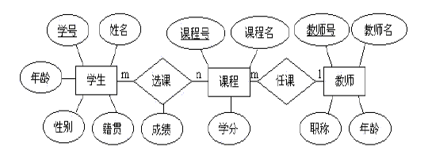
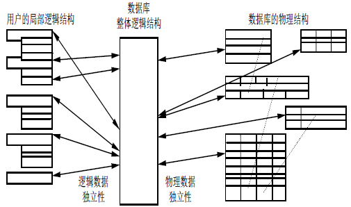
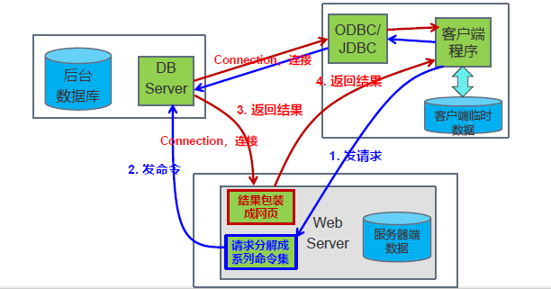

# 章一 绪论

## 系统之概述

数据库技术之四大概念：

- 数据：数据库中存储之基本对象，，其含义谓之数据之语义，不可再分。
- 数据库：存放数据之仓库，亦为计算机内有组织可共享之数据集合。
  - 较小冗余度。
  - 较高独立性。
  - 易扩展性。
- 数据库管理系统：建立、维护及使用数据库之软件。
  - 数据定义。
  - 数据组织、存储与管理。
  - 数据操纵。
  - 数据库之事务管理与运行管理。
  - 数据库之建立与维护。
- 数据库系统：由**数据库**、**数据库管理系统**、应用程序和数据库管理员组成之存储、管理与维护**数据**之系统。

数据管理技术之发展

- 人工管理阶段：脱机、人本。
- 文件系统阶段：外存、批处理。
- 数据库系统阶段：层次模型、网状模型、关系模型。
- 高级数据库技术阶段：现代应用。

数据库系统之特点

- 数据结构化：描述数据本身之特点及其间关系。
- 数据共享性高、冗余度低、易于扩充。
- 数据独立性高：物理独立性、逻辑独立性。[二级映像功能]
- 数据由DBMS统一管理和控制：**恢复**、**并发**、数据**完整性**、数据**安全性**。

## 数据模型

数据模型乃**对现实世界数据特征之抽象**。数据模型为**数据库系统之核心与基础**。

数据模型之*三要求*：真实模拟现实、易于理解、便于计算机实现。

数据模型之*三组成*：**数据结构**、**数据操作**、**数据完整性约束**。

- 数据结构：描述数据库之组成对象及其对象间之联系。
- 数据操作：对数据库中各种对象之实例可执行操作之集合及其规则。
- 数据完整性约束：一组完整性规则。

数据模型之*三大类*：概念模型、逻辑模型、物理模型。

信息术语：*CREATE TABLE Student(Sid INT PRIMARY KEY, Sname VARCHAR(50));*

- 实体：可区别之客观实在与概念之抽象。
- 属性：实体之特征描述。
- 域：属性之取值范围。
- 实体码/实体标识符：可唯一标识各实体之属性集。
- 实体型/实体模式/实体类型：实体名与其属性名之集合。
- 实体集：同质实体之集合。
- 联系/关系：可分为实体内部之联系与实体间之联系。
  - 实体内部联系：实体各属性间之联系。
  - 实体间之联系：异实体集间之联系。

机器术语：

- 记录：实体，字段之有序集。
- 文件：实体集，同类记录或不同类记录之集合。
- 主键：实体标识符，可唯一标识文件中每条记录之字段/字段集。
- 字段：属性，实体属性之命名单位。

实体集间之联系：

- 一对一。
- 一对多。
- 多对多。

E-R图：

逻辑数据模型：

- 层次模型：树形（有序树、森林）结构，记录为结点，联系为边。存储：邻接法（前序遍历）、链接法（指针）。
- 网状模型：有向图结构，记录为结点，联系为边。存储：链接法。
- 关系模型：二维表结构，联系为外键。存储：文件。
- 面向对象模型。

## 数据库系统结构

概念：

- 型 Type：对某一类数据结构与属性之说明。
- 值 Value：型之具体赋值。
- 模式 Schema：数据库中全体数据之逻辑结构与特征之表述，其反应数据之结构及其联系。
- 实例 Instance：模式之具体值。

各种数据库系统之共同特征：采用**三级模式结构**，提供**两级映像功能**。

三级模式结构：

- 外模式（子模式）：用户视图。用户可视或可用之逻辑结构与特征之表述。**一个数据库可有多个外模式**。，**一个应用程序只能只用一个外模式**。
- 模式：介于用户与物理实现之间，为所有用户之公共数据视图。其不涉及物理存储亦不涉及程式开发。为数据库中全部数据之逻辑结构与特征之表述，表述记录类型、联系、操作、完整性与安全性。一个数据库只有一个模式。
- 内模式：数据物理结构与存储方式之表述。其定义所有内部记录类型、索引与文件。一个数据库只有一个内模式。

两级映像：

- 模式-内模式映像。
- 外模式-模式映像。

数据库系统两级独立性：三个抽象级间通过两级映象（根据一定的对应规则）进行相互转换，使得**数据库的三级形成一个统一整体**，保证了数据的独立性。

- 物理独立性：内模式（存储结构）修改，其与模式之映射亦要随之修改，而使模式不变。即保证**数据**与**程序**之物理独立性。
- 逻辑独立性：模式修改，其与外模式之映像亦要随之修改，而使外模式不变。亦在保证**数据**与**程序**之逻辑独立性。

二级映像保证外模式之稳定，继而保证（透过外模式之结构而行驶之）程序之稳定。保证数据与程序间之独立，旨在简化程序之维护与修改。

## 数据库系统之组成

数据库系统之组成：

- 数据库：
  - 物理数据库：数据之集合。
  - 描述数据库：数据结构之表述。
- 硬件：CPU，内存、外存，I/O设备等。
- 软件：DBMS、OS、各种与数据库接口之高级语言以及编译系统、应用开发工具、数据库系统应用。
- 人员：
  - 数据库管理员：定义三模式，保证完全性，监控，重构。
  - 系统分析员。
  - 数据库设计人员。
  - 应用程序员。
  - 用户：通过应用程序之用户接口使用数据库者。

数据库系统架构模式与编程：

## 数据库管理系统
