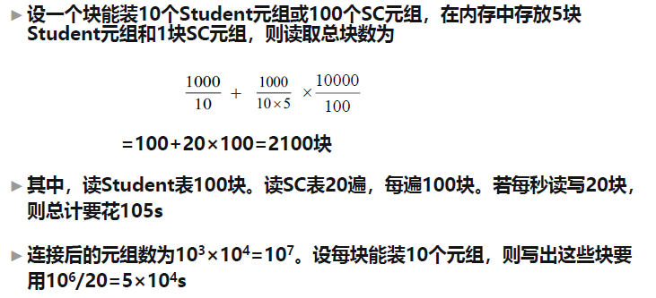
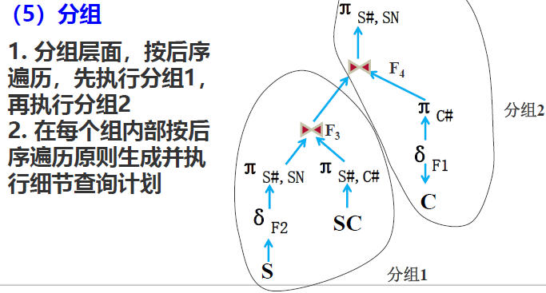

# 章九 查询处理和查询优化

## 关系数据库系统的查询处理

查询处理步骤：

- 查询分析：词法分析、语法分析、语义分析、符号名转换。
- 查询检查：安全性检查、完整性检查。（查询树/语法分析树）
- 查询优化：代数优化（操作变换优化）、物理优化（选择优化）。
  - 基于规则
  - 基于代价
  - 基于语义
- 查询执行：代码生成。

其中查询分析、查询检查和查询优化都依赖于**数据字典**执行。

实行查询操作的算法实例：

- 选择操作：
  - 简单的全表扫描方法：对查询的表进行顺序扫描，逐一检查每个元组是否满足选择条件。*适合小表，不适合大表。*
  - 索引（散列）扫描方法：选择条件中的属性上有索引，通过索引先找到满足条件的元组主键或指针，再通过指针直接再查询的基本表中找到对应元组。

    

    平衡B+树是最适合唯一索引的索引结构：根到叶子的深度一致，访问任何一条记录耗时稳定。叶子结点上指针指向索引项子集数组，所有索引数组相互链接构成一个链表形成一个有序的索引项全集。可以用于**全表顺序扫描**和**范围查询**。
  - 一般情况下，**当选择率较低时，基于索引的选择法的效率要高于全表扫描法**。但是在一些特殊情况中，如**选择率较高、查询的元组均匀地分布在表中，此时基于索引的查询的效率可能低于全表扫描法**。因为除了对表的扫描操作，还要加上对B+树索引的扫描操作，对每一个检索码，**从B+树根节点到叶子结点的路径上的每一个结点也都要执行一次I/O操作**。
- 连接操作
  - 循环嵌套法：最简单可行的办法，对外层循环的每一个元组，检索内层循环中的每一个元组，检查这两个元组在连接属性上是否相等，如果满足连接条件，则串接后作为输出结果，直到外层循环处理完所有的元组。（*两层for循环，起点index=0*）。时间复杂度$O(n \times m)$。
  - 排序合并法：如果要连接表没有排序，则先（按连接属性）排序。取第一个表的第一个元组中的连接属性值，依次扫描第二个表中具有相同该属性值的元组，由于已经排序，则顺序扫描即可，直到出现第一个不相等的值，将这些元组元组分别与第一个表拼接。之后取第一个表中第二个元组，重复上面步骤，直到第一个表全部扫描完。**不算排序**的时间复杂度：$O(n + m)$。
  - 索引连接法：在第二张表上建立连接属性的索引，扫描第一张表中的所有元组，取其连接属性，在通过索引查找到第二张表中符合连接条件的所有元组，拼接之，直至第一张表被遍历完。
  - 哈希连接法（**处理等值连接的算法**）：把连接属性作为哈希码，用同一个哈希函数把两张表中的元组散列到同一个哈希文件中（*我理解的是，假设哈希函数就是简单的取模运算，连接属性类型都是整型，通过同一个哈希函数的计算，两张表中连接属性值相同的元组会被散列到哈希表中相同的位置（可能以链表的形式存储），之后只要把处于哈希表中位置相同的元组拼接即可*）
    - 划分阶段：对包含较少元组的表进行一遍处理，通过哈希函数将其元组散列到哈希表的桶中。
    - 试探阶段（连接阶段）：对另一个表进行一遍处理，用同样的哈希函数将这张表中的元组散列到哈希桶中，把这张表的元组与桶中所有来自另一张表且与之匹配的元组连接。

## 关系数据库系统的查询优化

### 概述

DBMS系统提供的查询优化可以比用户程序的“优化”做的更好。

### 例子

求选修了2号课程的学生姓名。

其SQL代码为：

```sql
SELECT Sname FROM Student, SC WHERE Student.Sno=SC.Sno AND SC.Cno=2;
```

假定学生-课程数据库中有1000个学生记录，10000个选课记录。其中选秀2号课程的选课记录为50个。

系统可以同多种等价的关系代数表达式来完成：

- 第一种：$Q_1=\Pi_{Sname}(\sigma_{Student.Sno=SC=Sno \land SC.Cno=2}(Student \times SC))$。
- 第二种：$Q_2=\Pi_{Sname}(\sigma_{SC.Cno=2}(Student\bowtie SC))$。
- 第三种：$Q_3=\Pi_{Sname}(Student \bowtie \sigma_{SC.Cno=2}(SC) )$。

对于第一种：

- 计算广义笛卡尔积：

  - 把Student和SC的每个元组连接起来的做法：
    - 在内存种尽可能多地装入某个表地若干块，留出一块存放另一个表地元组
      - 从SC中读入一块和内存中地Student元组连接。
      - 把SC中地每个元组和Student中的每个元组连接，连接后的元组装满一块后就写道中间文件上。
      - 直到SC表处理完。
    - 再读入若干块Student元组，读入一块SC元组
    - 重复上述过程，直到把Student表处理完。
- 选择操作成本估算：

  

  - 作选择成本：依次读入连接首的元组，按照选择条件选取满足要求的记录。假定内存处理时间忽略，读取中间文件花费时间需要$5 \times 10^4s$。满足条件的元组假设仅50个，均可存放在内存。
  - 作投影操作：把第二步的结果在Sname上作投影输出，得到最终结果。第一种情况下的执行查询时间约为$105+2\times 5 \times 10^4=10^5s$。所有内存处理时间均忽略不计。

对于第二种：


对于第三种：


利用索引优化：


### 代数优化和物理优化

把代数表达式$Q_1$变换为$Q_2,Q_3$。即**有选择和连接操作时，先做选择操作**，这样参加连接的元组就可以大大减少，这是代数优化。

在$Q_3$中，SC表的选择操作算法有全表扫描和索引扫描2中办法，一般索引扫描方法较好。对于Student和SC表的连接，利用Student表上的索引，采用索引链接法代价也较小，这就是物理优化。

## 代数优化

代数优化策略：

- 通过对关系代数表达式的**等价变换**来提高查询效率。（等价：结果一样）
- 注意判断后续变换规则是否有利于提高查询效率。

常用的等价变换规则:


说明：有些选择条件可以合并，一次就可以检查全部条件以提高效率。有些不相关的只适合于部分数据或环节的条件，有时分开执行效率更高。


关系代数表达式等价变换的目的：

- 尽可能提高运算对关系的独立性。
- 减少对无关数据的不必要运算。
- 尽快缩小数据规模。

查询树的启发式优化：基于查询表达式的查询树，应用启发式规则，对查询树进行调整，得到优化后的查询树，实现查询优化。


典型规则：

- 选择运算尽可能先做（最jb，最重要）
- 把投影运算和选择运算同时进行。（避免重复扫描）
  - 若有若干投影和选择运算，并且都是对同一个关系操作，则可以在扫描此关系时同时完成所有的这些运算。
- 把通赢投影同其前或其后的双目运算结合起来，减少双目运算符所涉及的数据量。
- 把某些选择同在它前面要执行的笛卡尔积结合起来成为一个连接运算（笛卡尔积变连接）
- 找出公共子表达式一次计算保存临时结果重复利用。
- 利用等价变换规则4把形如$\sigma_{F_1 \land F_2 \land...\land F_n}(E)$变换为$\sigma_{F_1}(\sigma_{F_2}(...(\sigma_{F_n}(E))))$。
- **对每一个选择，利用等价变换规则4-9尽可能把它移到树的叶子结点。**
- **对于每一个投影利用等价变换规则3，5，10，11中的一般形式把它移向树的叶子节点。**
- 利用等价变换规则3-5把选择和投影的串接合并成单个选择、单个投影或一个选择后跟一个投影。**使多个选择或投影能同时进行，或在一次扫描中全部完成**。
- 把上述得到的语法树的内结点分组，每一个双目运算和它的直接祖先为一组。
  - 如果其后代直到叶子全是单目运算，则也将它们并入该组。
  - 但当双目运算符时笛卡尔积，且后面不是与他组成等值连接的选择时，则不能把选择和这个双目运算符组成同一组，而是把这些单目运算符单独分为一组。

分组的目的：

- 多粒度级执行计划生成和执行（总体计划和细节计划）
- 分组复用：充分共享已经执行的相同的查询。

例子：检索至少学习LIU老师所授一门课的女同学的学号和姓名：

其SQL为：

```sql
SELECT S#, SN FROM S,SC,C WHERE T='LIU' AND SEX='F' AND S.S#=SC.S# AND SC.C#=C.C#;
```




## 物理优化

代数优化改变查询语句中的操作的次序和组合，不涉及底层的存取路径。而对于一个查询语句有许多存取方案，他们的执行效率不同，仅仅进行代数优化是不够的。物理优化就是要选择高效合理的操作算法或存取路径，求得优化的查询计划。

### 基于启发式规则的存取路径选择优化

选择操作的启发式规则：

- 对于小关系，使用全表扫描，有索引也不用。
- 对于大关系：

  - 若选择条件是key=value，查询结果最多是一个元组，可以选择主键索引。
  - 若选择条件是非主属性=值，且选择的列上有索引，需要估算结果的元素数量，如果比例较小（10%<）可以使用索引扫描，否则还是全表扫描。
- 对于选择条件是属性上的非等值查询或者查询是范围查询，且选择的列上有索引，若比例较小（10%<）可以使用索引扫描，否则还是全表顺序扫描。
- 对于用AND连接的合取选择条件

  - 如果有涉及这些属性的组合（聚集）索引，则优先采用组合索引扫描法。
  - 如果某些属性上有一般索引，若数据量<10%，则用索引，否则全表扫描。
- 对于用OR连接的析取选择条件，一般使用全表顺序扫描。

连接操作的启发式规则：

- 如果两个表都已经按照连接属性排序，则选用排序-合并法。
- 如果一个表在连接属性上有索引，则选择索引连接法。
- 若上面两个规则都不适用，且其中一个表比较小，则选用哈希连接法。
- 可以选择嵌套循环法，并选择其中较小表（用块数最少的表）作为外循环。

  

### 基于代价的优化

启发式规则优化是定性的选择，适合解释执行系统（优化开销包含在查询总开销之中）。

编译执行的系统中查询优化和查询执行是分开的，可以采用精细复杂的基于代价的优化方法。

#### 统计信息


代价估算示例：

- 全表扫描算法的代价估算：
  - 若基本表的大小为B块，全表扫描算法的代价为B。
  - 若选择条件是key=value，则平均搜索代价为B/2。
- 索引扫描算法的代价估算：
  - 选择条件为key=value，若B+树层数为L，则代价为L+1。
  - 选择条件涉及非主键属性：若有S个元组满足条件，最坏情况下满足条件的元组在不同的块中，此时代价为L+S。
  - 若比较条件是>, >=, <, <=操作，假设有一半的元组满足条件就要存取一半的叶子节点，通过索引访问一半的表存储块代价为L+Y/2+B/2。如果可以获得更准确的选择基数，可以进一步修正Y/2和B/2。
- 嵌套循环连接算法的代价估算：
  - 代价为$B_r + (B_s/(K-1))\times B_r$，其中$B_r，B_s$为两张表分别占用的块数，$K$为连接操作使用的内存缓冲区块数。
  - 如果要把连接结果写回磁盘，则代价为$Cost=B_r+(B_s/(K-1))\times B_r + (F_{rs}\times N_r \times N_s)/M_{rs}$。其中$F_{rs}$为连接选择性，表示连接结果元组数的比例。$M_{rs}$表示每块中可以存放的结果元组的数目，$N_r, N_s$分别是两个关系的元组数目，其乘积为笛卡尔积结果元组数。
- 排序-合并连接算法的代价估算：
  - 如果连接表已经排完序，则$Cost=B_r + B_s + (F_{rs}\times N_r \times N_s)/M_{rs}$。
  - 如果要对文件进行排序，对于包含B块的文件排序代价大约是$2B+2Blog_2B$。

## SQL调优
