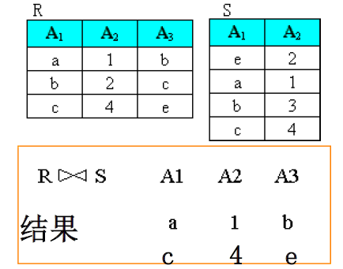

# 章二 关系数据库

系统仅靠关系型能力就可完整管理数据库。

**用*二维表*表示实体集，用*外键*表示实体间之联系者为关系型数据库。**

关系模型之组成：

- 数据结构：关系。
- 数据操作：查询、更新。
- 完整性规则：实体完整性、参照完整性、用户定义完整性。

## 关系数据库结构及形式化定义

### 关系

关系为关系模型中**单一的数据结构**。其逻辑结构**二维表**。关系模型依赖于**集合代数**。

形式化定义：

- 域（Domain）：一组具有相同数据类型的值之集合。
- 笛卡尔积：给定一组域：$\{D_1,D_2,...,D_n\}$，则其笛卡尔积为$\{D_1\times D_2\times...\times D_n\}$。即所有域之所有取值之完全排列组合，且不可重复。

  - 笛卡尔积之基数：$\prod_{i=1}^N ||D_i||$，其中$||D_i||$为该域之范数（长度）。例如：$D_1=Set(Tutor)=\{Zhang, Liu\},D_2=Set(Major)=\{CS,IT\}, D_3=Set(Graduates)=\{Li, Chen, Wang\}$。则其基数为$2\times 2 \times 3 = 12$。
- 关系：域笛卡尔积之子集谓为该域上的关系，写为$R(D_1,D_2,..,D_n)$。其中$R$为关系名，$n$为关系之度。此为$n$元关系。一般有一元关系、二元关系。
- 元组（Tuple）：关系中每个元素为关系中之元组，常以$t$表示。
- 关系之表示：关系亦为一个二维表，表之**行**对应关系之**元组**。表之**列**对应**域**。表之**列值集**对应为**域之子集**。
- 属性：

  - 关系中不同列可以对应相同的域。
  - 为了加以区分，必须对每列起一个名字，谓之**属性**。
  - $n$目关系必有$n$个属性。

特殊的属性集：

- 候选码：若关系（表）中的某一属性组的值可以唯一标识一个元组（行），则称该属性组为候选码。
- 主键：从候选码中选定一个作为之。
- 外键：如果关系$R$的某一个或某一组属性不是本身的码，而是另一个关系$S$的主键，则称该属性或属性组为$R$的外键。

关系的性质：

- 一个关系（表）中不存在两个元组（行）在各个字段（属性/列）上完全相同。
- 行、列的次序无所谓。
- 每个属性（列）不可再分。
- 列的分量是同一类型的数据，来自同一域。

三类关系：

- 基本表：实际存在的表，是实际存储数据的逻辑表示。
- 查询表：查询结果对应的表。
- 视图表：由基本表或其他视图导出的虚表，不对应实际存储的数据。

### 关系模式

关系是元组的集合，**关系模式是指出元组集合的结构，以及关系遵循的完整性约束条件**。

关系模式的形式化表示：$R(U,D,DOM,F)$。其中$U$为属性集，$D$为域集，$DOM$为属性与域之间来源关系集， $F$为属性间的依赖关系集。

**二维表的表头就是关系模式！*(DESC [TABLE_NAME];) --> 表的框架、记录类型。***

关系模式至少包括：模式名、属性名、值域名和完整性约束。

关系模式是静态的，而关系是动态的。

### 关系数据库

所有关系的集合构成的数据库。

关系数据库模式：对整个关系数据库的描述，关系数据库是所有关系模式某一时刻对应的关系的集合。

## 关系完整性

 关系的完整性是对数据的**约束**：

三类完整性约束：

- 实体完整性：基本关系$R$的**主属性不能取NULL**。
- 参照完整性：定义主-外键之间的引用规则。**不引用不存在的实体**。外键的取值或为NULL，或为对应关系中的某个主键值。
- 用户定义完整性：针对不同的应用环境而定义的约束条件。

其中**实体完整性和参照完整性是关系模型必须满足的完整性约束条件**，由数据库系统自动支持。而**用户定义完整性是应用领域要遵循的约束条件、业务规则**。

## 关系代数

关系查询语句的两大类：

- 关系代数语言：用关系（集合）运算来表达查询要求。
- 关系演算语言：用谓词演算来表达查询要求。

其均属于**非过程性语言**。关系代数的运算对象和结果都是关系。

运算符：

- 集合运算符：（从**行**的角度运算）

  - 合并 $\cup$：两个表结构一样的表拼接（添加行）。
  - 相交 $\cap$：两个表结构相同的表中一样的行的集合。
  - 差 $-$：从一个表中删去与另一个表结构相同的表的交集。
  - 笛卡尔积 $\times$：两个表（无要求）中以行为单位的笛卡尔积运算（全排列）。$R\times S$的结果的行数为$R$和$S$中行数之**积**。$R \times S$的结果的列数为$R$和$S$的列数之**和**。
- 专门关系运算符：（从**行和列的角度进行运算）

  - 选择 $\sigma$：从表（关系）中选择满足一定条件的**行（元组）**组成新的表（关系）。其代数表达为$\sigma_F(R)=\{t|t \in R \land F(t) = true\}$。其中$F$为条件逻辑表达式。**（从行的角度进行运算），即：*WHERE*语句。**
  - 投影 $\Pi$：从现有表（关系）中选择某些**列（属性）**组成新的表（关系）。**（从列的角度进行运算），即*SELECT A.a, A.b, A.c FROM A*语句。**
  - 连接 $\bowtie$：从两个关系的笛卡尔积中选取满足一定条件的元组，记作：$R \bowtie S = \sigma_{i \theta (r+j)}(R \times S)$。

    - $\theta$连接：但条件连接。
    - F连接：多条件连接。
    - 自然连接：两个表进行比较的分量是相同的属性组，并在结果中去掉重复的属性列。

      

      与等值连接的区别：

      - 在自然连接中要求值相等的属性名也一样，而等值连接只要求值相等。
      - 自然连接结果要去掉重复的属性名，而等值连接不需要。
      - 若两个表没有公共属性，自然连接转化为笛卡尔积。
    - 象集：

      
  - 求商 $\div$：找到一个表$Q$，使得$R \times Q = S$。或者说$S$中每一行与$R$中等值行的象集集合。$R$能被$S$除的充要条件：$R$中包含$S$中的部分属性。$R$中有一些属性不出现在$S$中。

    
- **算数比较符。**
- **逻辑运算符。**

外连接⟗：自然连接中保留被丢弃的元组，并给其值填上NULL。

左连接⟕：$R$和$S$做自然连接时把$R$原本该舍弃的元组填上NULL。

右连接⟖：$R$和$S$做自然连接时把$S$原本该舍弃的元组填上NULL。
