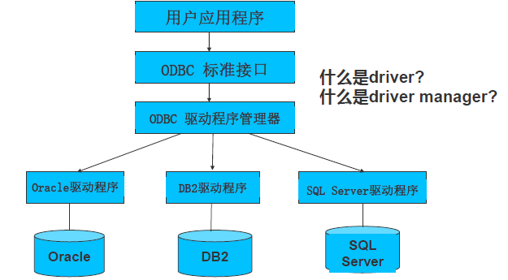
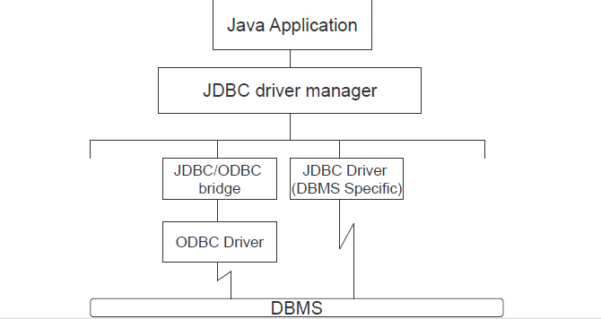
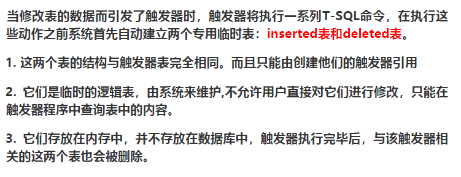

# 章八 数据库编程

## 嵌入式SQL

- 将数据库命令嵌入到通用程序设计语言中。
- 使用数据库函数库。
- 设计一种全新语言。

嵌入式SQL实现：采用预编译方式，先用预处理程序对源程序进行扫描，识别出 SQL 语句，把 SQL语句转换成主语言调用语句，然后再用宿主语言的编译程序把源程序编译成目标
程序。

嵌入式SQL语句与主语句之间的通信：SQL语句负责操纵数据库，高级语言负责控制程序流程。

- SQL通信区
  - 向主语言传递SQL语句执行状态信息。
    - SQL语句执行成功，SQLCODE=0；
    - SQL执行失败，SQLCODE!=0，存放错误代码。
  - 使主语言能够据此信息控制程序流程。
- 主变量
  - 主语言向SQL语句提供参数。
    ```java
    String param1, param2;
    String sql = "select sname into " + param1 + " from s where sno=" + param2;
    ```
  - 将SQL语句查询数据库的结果交予主语言进一步处理。
- 游标
  - 解决集合性操作语言与过程性操作语言的不匹配。
  - 游标是系统为用户开设的一个**数据缓冲区**，存放SQL语句的执行结果，每个游标区有一个名字。通过游标逐一获取记录并赋给主变量，交给主语言处理。（*过程化语言和非过程化语言的中介，单记录值转化为多记录*）
  - 定义游标：

    ```sql
    EXEC SQL DECLARE  <cursor_name> CURSOR FOR <select_phrase>;
    ```
  - 打开游标：

    ```sql
    EXEC SQL OPEN <cursor_name>;
    ```
  - 游标取值：

    ```sql
    EXEC SQL FETCH <cursor_name> INTO <table_name>;
    ```
  - 关闭游标

    ```sql
    EXEC SQL CLOSE <cursor_name>;
    ```

嵌入式SQL的使用情况

- 不使用游标的SQL语句：
  - 说明性
  - 数据定义
  - 数据控制
  - 单记录查询
  - 非CURRENT形式的UPDATE
  - 非CURRENT形式的DELETE
  - INSERT语句
- 使用游标的SQL语句：
  - 多记录查询
  - CURRENT形式的UPDATE
  - CURRENT形式的DELETE

动态SQL：语句中查询条件、要查询的属性、要查询的表等在预编译时不确定，只有在运行过程中确定（静态的这些在预编译时就可以确定）

- 直接执行的动态SQL：非查询的SQL语句，EXEC SQL EXECUTE IMMEDIATE
- 带动态参数的动态SQL：使用参数符号，动态参数通过PREPARE语句准备SQL主变量，用EXECUTE语句绑定数据或主变量。
- 查询类动态SQL。

## ODBC和SQL/CLI



## JDBC

面向JAVA的SQL函数调用。



典型步骤：

- 导入JDBC库

  ```java
  import java.sql.*;
  ```
- 加载JDBC驱动。
- 使用JDBC DriverManager类的getConnection函数建立连接对象。
- 创建语句对象。
- 绑定参数和程序变量。使用executeQuery执行SQL语句，返回一个ResultSet类型对象。
- ResultSet类型对象r类似于游标，r.next()移向r的下一个元组。
- 通过get函数引用元组的属性。

## 存储过程

SQL中的函数。

- 模块化编程
- 快速执行：第一次执行后就驻留在内存了，下次执行不用重新分析、优化和编译。
- 减少网络通信量
- 安全机制：通过隔离和加密方式提高数据库安全性，通过授权让用户只能调用procedure而不能直接访问数据库对象。

分类：

- 系统存储过程
- 用户自定义存储过程

  ```sql
  DELIMITER $$
  CREATE PROCEDURE procedure_name([IN/OUT]param_name,...)
  BEGIN
  	SQL PHRASE [WITH {RECOMPILE|ENCRYPTION}];
  END
  $$
  DELIMITER ;
  ```

  修改：ALTER，删除：DROP。

## 触发器

一种特殊类型的存储过程。其在指定表中的数据发生变化时自动执行。

类型：

- AFTER触发器
- INSTEAD OF（BEFORE）触发器

INSERT, DELETE触发器工作原理：系统先自动建立inserted和deleted两个专用临时表。



- insert触发器：向表插入数据时，insert触发器自动执行，新增加的记录增加到触发器表中和inserted表中。
- delete触发器：在表中删除记录的时候，delete触发器自动执行，被删除的记录在deleted表中。

UPDATE触发器工作原理：修改时执行，执行一条update语句相当于先执行delete再执行insert。所以旧的行被移动到deleted表，新的行同时插入inserted表。

创建触发器

```sql
CREATE TRIGGER <trigger_name> ON <table_name|view_name> [WITH ENCRYPTION]
FOR|AFTER|INSTEAD OF {[INSERT],[UPDATE],[DELETE]} AS 
BEGIN
	SQL PHRASE;
END
```

修改和删除：alter，drop。
