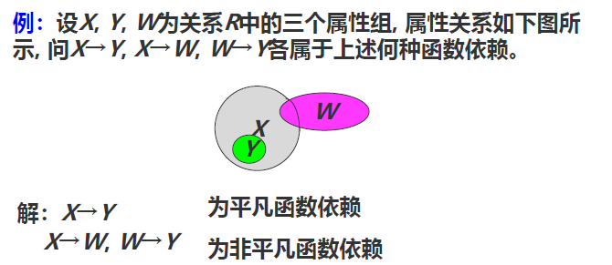
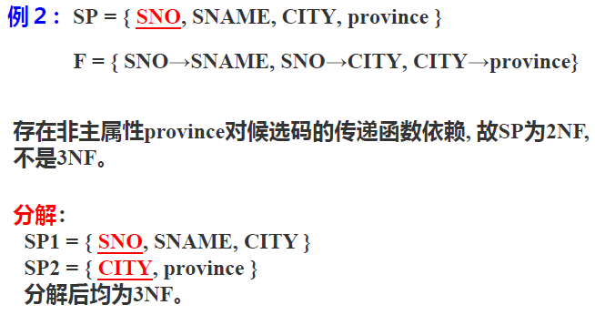

# 章六 关系的规范化设计

## 问题的提出

泛关系模式中存在的问题：

- 数据冗余
- 更新异常
- 插入异常
- 删除异常

关系模式设计：按照一定的原则从数量众多而又相互关联的数据中，构造出一组既能较好地**反映现实世界**，又有良好地**操作性能**地关系模式。

## 函数依赖

数据依赖：通过一个关系中不同元组属性间值的相等与否体现出来的数据间的相互关系，分为函数依赖和多值依赖。

- 函数依赖：反映属性或属性组之间的相互依存，相互制约的关系，即**反映现实世界的约束关系**。
  - 定义：设$R(U)$是属性集$U$上的一个关系模式，$X$和$Y$均为$U=\{A_1,A_2...,A_n\}$的子集，$r$为$R$的任一关系，如果对于$r$中的任意两个元组$u,v$，只要有$u[X]=v[X]$，就有$u[Y]=v[Y]$，则称$X$函数决定$Y$，或称$Y$函数依赖于$X$，记为$X \rarr Y$。
  - 属性间联系决定函数依赖关系：设$X,Y$均是$U$的子集：
    - $X$和$Y$之间联系是1：1，则$X \rarr Y, Y \rarr X$。
    - $X$和$Y$之间联系是M：1（M>1），则$X \rarr Y$。
    - $X$和$Y$之间联系是M：N，则$X$和$Y$之间不存在函数依赖。
  - 自反性、增广性和传递性：设$U$是关系模式$R$的属性集，$F$是$R$上成立的只涉及到$U$中属性的函数依赖集，则：
    - 自反性：若$Y \subseteq X \subseteq U$，则$X \rarr Y$在$R$上成立。
    - 增广性：若$X \rarr Y$在$R$上成立，且$Z \subseteq U$，则$XZ \rarr YZ$在$R$上成立。
    - 传递性：若$X\rarr Y$和$Y \rarr Z$在$R$上成立，则$X\rarr Z$在$R$上成立。
  - 完全函数依赖和部分函数依赖：在$R(U)$中，如果$X\rarr Y$，并且对于$X$的任何真子集$X'$都不存在$X' \rarr Y$，则称$Y$函数完全依赖于$X$，记作$X \rarr^F Y$；否则则称$Y$部分函数依赖于$X$，记作$X\rarr^P Y$。（*非完全依赖就是可以在当前表中选出一些属性划出去单独作为一个新的表在语义上也是合理的，即当前表的语义不是最小的组合单位*）
  - 平凡函数依赖和非平凡函数依赖：设$X,Y$为某关系上的属性集，且$X\rarr Y$：
    - 若$Y$包含于$X$，则称$X\rarr Y$为平凡函数依赖。
    - 若$Y$不包含于$X$，则称$X\rarr Y$为非平凡函数依赖。

      

## 范式

关系模式满足的确定约束条件称为范式，根据满足约束条件的级别不同分为：（由低到高）

    

- 1NF：关系模式的所有域为简单域，其元素不可再分，即**属性不能再分**。*就是不能有子表，一列有两个子列*。

  - 不满足1NF的关系称为非规范化关系。
  - 第一范式是对关系模式的最基本的要求，但是满足第一范式的不一定是一个好的关系模式（插入异常、删除异常、数据冗余度大、修改复杂，原因：**存在部分函数依赖**）。
- 2NF：给定关系模式$R$及其上的函数依赖集$F$，$R$的任何一个非主属性都完全函数依赖于主键。如何把非2NF范式的关系模式转换为2NF：使用投影分解。在2NF中，**仍然存在传递函数依赖**。
- 3NF：给定关系模式$R$及其上的函数依赖集$F$，如果$R$的任何一个**非主属性**都**不传递函数依赖**于它的任何一个**候选码**，则称$R$满足第三范式。（3NF必定2NF）。

  
- BCNF：给定关系模式$R$及其上的函数依赖集$F$，如果$F$中的每个非平凡函数依赖$X\rarr Y$的左部（决定因素）$X$中必含有候选码，则称$R$满足BCNF。

  - $R$是第一范式，若$X \rarr Y$且$Y \subsetneq X$，$X$中必含有候选码，则$R$是BCNF。
  - 内涵：
    - 非主属性对码完全函数依赖。
    - 非主属性不传递函数依赖于任何一个码。
    - 主属性不对含它的码完全函数依赖。
    - 主属性不传递函数依赖于任何一个码。
    - 没有属性完全函数依赖于一组非主属性。（主属性：候选码所有属性的并集）
  - BCNF满足3NF。

  1NF到2NF消除非主属性对码的部分函数依赖，2NF到3NF消除非主属性对码的传递函数依赖，3NF到BCNF消除主属性对码的部分和传递函数依赖。

关系模式的规范化：把一个低一级的关系模式分解为高一级范式的关系模式的过程。

## 多值依赖

函数依赖有效地表达了属性之间多对一的联系，但是无法表达属性之间一对多、多对多的联系。

定义：设$R(U)$是属性$U$上的一个关系模式，$X,Y,Z$均为$U=\{A_1, A_2,...,A_n\}$的子集，并且$Z=U-X-Y$，用小写字母$x,y,z$分别代表属性集$X,Y,Z$的值，关系模式$R(U)$中多值依赖$X \rarr \rarr Y$成立，当且仅当对$R(U)$的任一关系$r$，给定一对$(x,z)$值，有一组$Y$的值仅仅决定于$x$值而与$z$值无关。

性质：（$X,Y,Z \subset U, Z=U-X-Y$）

- 对称性：  $X \rarr \rarr Y$则$X \rarr \rarr Z$。
- 传递性：$X \rarr \rarr Y, Y \rarr \rarr Z$则$X \rarr \rarr Z-Y$。
- 函数依赖是多值依赖的特殊情况：$X \rarr Y$则$X \rarr \rarr Y$。
- 若$X \rarr \rarr Y, X \rarr \rarr Z$，则$X \rarr YZ$。
- 若$X \rarr \rarr Y, X \rarr \rarr Z$，则$X \rarr \rarr Y \cap Z$。
- 若$X \rarr \rarr Y, X \rarr \rarr Z$，则$X \rarr \rarr Y - Z, X \rarr \rarr Z-Y$。

函数依赖和多值依赖的区别：

- 函数依赖在小范围内成立则在大范围上一定成立；多值依赖在小范围内成立，在更大范围上未必成立。
- 若函数依赖$X \rarr Y$在$R(U)$上成立，则对于任何$Y$的真子集$Y'$均有$X \rarr Y'$成立。而对于多值依赖$X \rarr \rarr Y$在$R(U)$上成立，却不能断言对于任何$Y$之真子集$Y'$均有$X \rarr \rarr Y'$也成立。
- 平凡多值依赖和非平凡多值依赖：对于属性集$U$上的一个多值依赖$X \rarr \rarr Y$，如果$X$包含$Y$或者$Z=U-X-Y=\emptyset$，则称$X \rarr \rarr Y$为平凡的多值依赖，否则称之为非平凡的多值依赖。

第四范式和第五范式不考啊。
