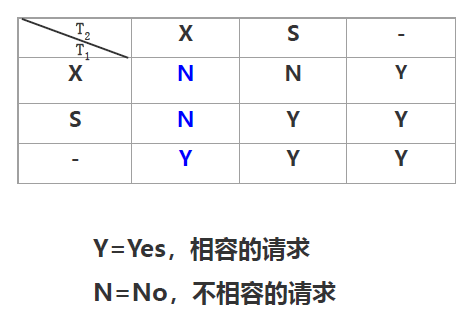
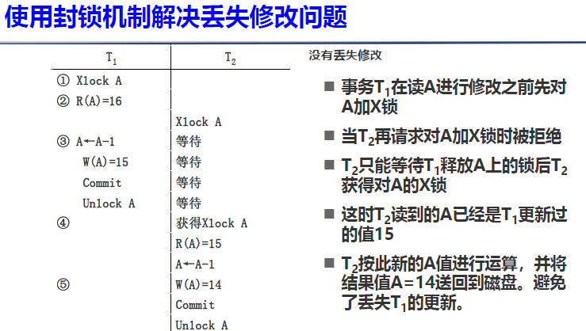
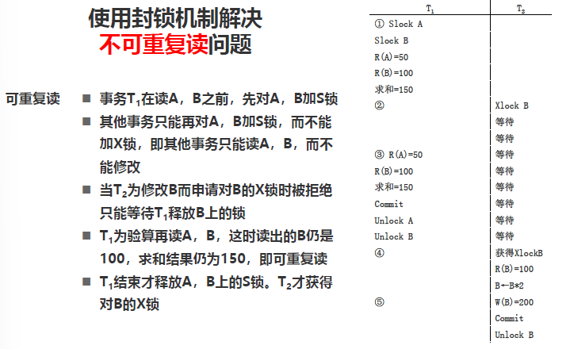
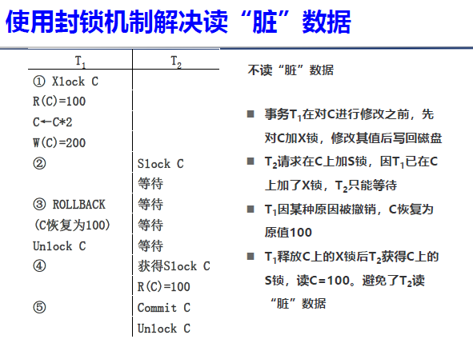
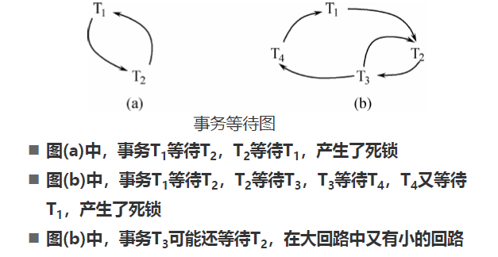
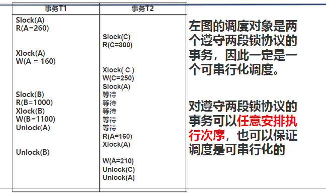
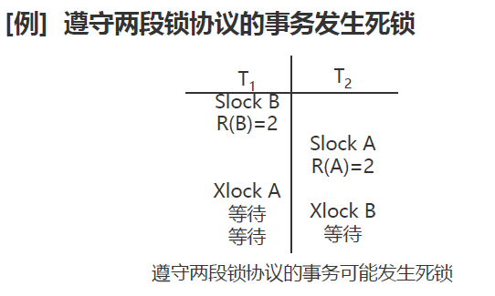
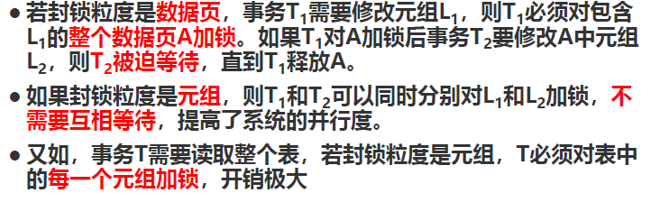
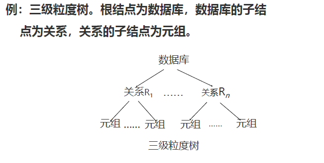

# 章十一 并发控制

问题产生的背景：多用户数据库系统。

不同的多事务执行方式：

- 事务穿行执行：每个时刻只有一个事务执行，其他不许等待至该事务结束后方能运行。
- 交叉并发方式：在单处理机系统中并发执行的实质是并发事务的操作轮流交叉运行，其并没有真正的并行运行，但能够减少空闲时间，提高系统效率。
- 同时并发方式：多处理机系统中每个处理机可以运行一个事务，多处理机同时运行多个事务，实现真正的并发事务并发执行。

并发事务并行执行带来的问题：

- 会产生多个事务同时存取同一数据的情况。
- 可能会存取和存储不正确的数据，破坏事务的一致性和数据库的一致性。

## 并发控制概述

实现并发操作的正确调度，以保证**事务的隔离性**和**数据库的一致性**。

并发操作带来的数据不一致：

- 丢失修改
- 不可重复读
- 读脏数据

记号：

- $R(x)$：读数据$x$。
- $W(x)$：写数据$x$。

### 丢失修改

两个事务$T_1$和$T_2$读入同一数据并修改。$T_2$的提交结果破坏了$T_1$的提交结果，导致$T_1$的修改被丢失。（$T_1$*本来要读，结果读的过程中值被$T_2$改了*）

### 不可重复读

不可重复读是指事务$T_1$读取数据后，事务$T_2$执行**更新**操作，使$T_1$无法再现前一次读取结果，有三种情况：

- 事务$T_1$读取某一数据后，事务$T_2$对其作了**修改**，当事务$T_1$再次读该数据时，得到与前一次不同的值。
- 事务$T_1$按一定条件从数据库中读取了某些数据记录后，事务$T_2$**删除**了其中部分记录，当$T_1$再次按相同条件读取数据时发现某些记录消失了。
- 事务$T_1$按一定条件从数据库中读取了某些数据记录后，事务$T_2$**插入**了一些记录，当$T_1$再次按照相同条件读取数据时，发现多了一些记录。后两种不可重复读有时也称为幻影现象。

### 读脏数据

读脏数据是指：

- 事务$T_1$修改某一数据，并将其写回磁盘。
- 事务$T_2$读取同一数据后，$T_1$由于某种原因被撤销。
- 这时$T_1$已经修改过的数据恢复原值，$T_2$读到的数据就与数据库中的数据不一致。
- $T_2$读到的数据就为脏数据，即不正确的数据。

### 主要技术

- 封锁
- 时间戳
- 乐观控制

## 封锁

封锁就是事务$T$在对某个数据对象（表、记录等）操作之前，**先向系统发出请求，对其加锁**。加锁后事务$T$就对该数据对象有了一定的控制，在事务$T$释放它的锁之前，其他事务无权更新此数据对象。

基本封锁类型：

- 排它锁（X锁）：写锁，若事务$T$对数据对象$A$加上X锁，则只允许$T$读取和修改$A$，其他任何事务都i不能再对$A$加任何类型的锁，直到$T$释放$A$上的锁。保证了其他事务在$T$释放$A$上的锁之前不能再读取和修改$A$。
- 共享锁（S锁）：读锁，若事务$T$对数据对象$A$加上S锁，则其他事务只能再对$A$加S锁而不能加X锁，直到$T$释放了$A$上的S锁。这样保证了其他事务可以读$A$，但在$T$释放$A$上的S锁之前不能对$A$做任何修改。

锁的相容矩阵：

$T_2$的请求能否被满足用矩阵中的Y和N标识。

## 活锁和死锁

### 活锁

事务$T_1$封锁了数据$R$，事务$T_2$又请求封锁$R$，于是$T_2$等待。$T_3$也请求封锁$R$，当$T_1$释放了$R$上的封锁之后系统首先批准了$T_3$的请求，$T_2$仍然等待。$T_4$又请求封锁$R$，当$T_3$释放了$R$上的封锁后系统又批准了$T_4$的请求。导致$T_2$可能**永久等待或者等待时间过长**。

避免活锁：采用**先来先服务**策略。

### 死锁

事务$T_1$封锁了数据$R_1$，$T_2$封锁了数据$R_2$，$T_1$又请求封锁$R_2$，因$T_2$已经封锁了$R_2$，于是$T_1$等待$T_2$释放$R_2$上的锁。接着$T_2$又申请封锁$R_1$，但因为$T_1$已经封锁了$R_1$，$T_2$也只能等待$T_1$释放$R_1$上的锁。这样$T_1$等待$T_2$，$T_2$等待$T_1$，两个事务永远不能结束，形成死锁。

解决死锁：

- 预防死锁：**破坏产生死锁的条件**。（数据库系统中用的少）
  - 一次封锁法：要求每个事务必须一次将所有要使用的数据全部加锁，否则不能继续执行。（降低并发度、难以事先准确确定封锁对象）
  - 顺序封锁法：预先对数据对象规定一个封锁顺序，所有事务都按照这个顺序实施封锁。（维护成本高，难以实现）
- 死锁的诊断与解除：
  - 超时法：如果一个事务等待时间超过了规定的时限，就认为发生了死锁。实现简单，但是时限太短容易误判，时限太长容易不能及时发现死锁。
  - 事务等待图法：用事务等待图动态反映所有事务的等待情况。事务等待图是一个有向图$G=(T,U)$，$T$为结点的集合，表示正在运行的事务；$U$为边的集合，每条边表示事务的等待情况。（若$T_1$等待$T_2$，则结点$T_1$有一条边指向$T_2$）

    
  - 死锁检测与解除：并发控制子系统周期性的生成事务等待图，检测事务。**如果发现图中存在回路，则表示系统中出现了死锁**。解除死锁：消灭贿赂。选择一个处理死锁代价最小的事务将其撤销，释放此事务持有的全部锁，使其它事务能继续运行下去。

## 并发事务调度的可串行化

调度：对并发到达的事务安排执行次序。

### 可串行化调度

- 可串行化掉地：多个并发事务的并行执行是正确的，当且仅当其结果与按某一次序串行的执行这些事务的结果一致。
- 可串行性准则：可定一个并发事务调度方案，当且仅当它是可串行化的，才认为是正确调度。

### 冲突可串行化调度

冲突操作：指不同的事务对同一个数据的读写操作和写写操作。其他操作是不冲突的。

并发事务操作次序的可交换性：

- 调度序列中操作次序的可交换性：
  - 交换给定调度序列中的相邻操作是否会影响并发调度结果。会则不可交换、否则可以。
  - **不同事务的冲突操作不能交换**。**同一事务的两个操作不能交换**。

一个调度可串行化的***充分***条件：一个调度Sc在满足前后相邻操作的可交换性的前提下，通过迭代交换Sc中属于不同事务的相邻不冲突的操作次序得到另一个调度Sc'，如果Sc'是可串行的，称调度Sc为冲突可串行化的调度。即一个调度是**冲突可串行化**，一定是**可串行化调度**。

## 两段锁协议

封锁协议：运用封锁方法对数据对象加锁时需要约定一些规则。

两段封锁协议：对都遵循两段封锁协议的事务按任意次序进行调度得到的调度结果肯定是可串行化的。所有事务必须分两个阶段对数据项加锁和解锁。

- 对任何数据进行读、写操作之前，事务首先要获得对该数据的封锁。
- 在释放一个锁之后，事务不再申请和获得任何其他锁。

含义：

- 第一阶段是获得封锁，也称扩展阶段
  - 事务可以申请获得任何数据项上的任何类型的锁，但不能释放任何锁。
- 第二阶段是释放封锁，也成为收缩阶段
  - 事务可以释放任何数据项上的任何类型的锁，但是不能申请任何锁。

两段锁牺牲了一定的并发性。

**事务遵守两段锁协议是可串行化调度的充分条件，而非必要条件。**

若并发事务都遵循两段锁协议，则对这些事务的任何并发调度策略都是可串行化的（易于并发控制）若并发事务的一个调度是可串行化的，不一定所有事务都符合两段锁协议。

两段锁协议与防止死锁的一次封锁法：

- 一次封锁法要求每个事务必须一次将所有要使用的数据全部加锁，否则就不能继续执行，因此一次封锁法遵守两段锁协议。
- 但是两段锁协议并不要求事务必须一次将所有要使用的数据全部加锁，因此**遵守两段锁协议的事务可能发生死锁**。

  

## 封锁粒度

封锁粒度：封锁对象的大小（封锁对象：逻辑单元[属性值、元组、索引项、整个数据库等]、物理单元[页面、物理记录等]）

选择封锁粒度原则：封锁粒度与系统的并发度叫欸并发控制开销密切相关。

- 封锁的粒度越大，数据库所能封锁的数据单元就越少，并发度就越小，系统开销也越小（简单粗暴成本低效果差）
- 封锁粒度越小，并发度越高，但系统开销也就越大（复杂精细成本高效果好）

  

多粒度封锁：在一个系统中同时支持多种封锁粒度供不同事务选择。

选择封锁粒度：同时考虑封锁开销和并发度两个因素：

- 需要处理多个关系的大量元组的用户事务：以数据库为封锁单位。
- 只需要处理大量元组的用户事务：以关系为封锁单元。
- 只处理少量元组的用户事务：以元组为封锁单位。

多粒度树：

- 以树形结构来表示多级封锁粒度
- 根结点是整个数据库，表示最大的数据力度
- 叶子节点表示最小的数据力度

  

多粒度封锁协议：

- 允许多粒度树的每个结点被独立的加锁。
- 对一个结点加锁意味着这个结点的所有后裔结点也被加以同样类型的锁。
- 在多粒度封锁中一个数据对象可能以两种方式封锁：
  - 显示封锁：直接加到数据对象上的封锁。
  - 隐式封锁：该数据对象没有独立加锁，是由于其上级结点加锁而使该对象被加了锁。

加锁时的封锁检查：

- 系统检查封锁冲突时对于显示和隐式封锁都要检查（同时检查其本身、上级结点和下级结点）。

对某个数据对象加锁，系统要检查：

- 该数据对象有无显示封锁与之冲突。
- 所有上级结点
- 所有下级结点
