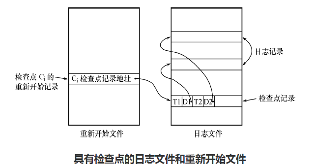

# 章十 数据库恢复技术

## 事务的基本概念

### 事务定义

事务是用户定义的一个数据库操作序列。这些操作要么都做，要么滚蛋。是一个不可分割的工作单位。是恢复和并发控制的基本单位。

一个事务可以是一个或多个SQL语句，也可以是一个或多个程序，一般一个程序包含多个事务。

显示定义事务：

```sql
BEGIN TRANSACTION
	SQL 1
	SQL 2
	...
COMMIT|ROLLBACK
```

隐式定义：DBMS按缺省规定自动划分事务。

### 性质（ACID）

原子性：原语，不可分割，有DBMS保持其原子性。

一致性：不会破坏数据库的一致性，由DBMS的完整性子系统执行测试，

隔离性：并发执行多个事务的结果与顺序执行结果一致，由DBMS并发控制子系统实现。

永久性、持续性：提交后对数据库的所有更新永久的反映在数据库中。

## 数据库恢复

不可避免，软硬件故障和人为故障。

## 故障的种类

### 事务故障

- 可以预期的事务故障：应用程序可以发现，通过回滚撤销错误的故障事务。
- 不可预期的事务故障：运算溢出、发生死锁、违反完整性约束等。

系统强行回滚此事务，即撤销该事务对数据库所做的任何修改。

### 系统故障

造成数据库系统停止运行的事件，需要重启系统。

- 整个系统的正常运行突然被破坏。
- 所有在正常运行的事务被非正常终止。
- 不破坏数据库。
- 内存中数据库缓冲区的信息全部丢失。

系统故障恢复：

- 发生系统故障时，事务未提交
  - 强行撤销所有未完成事务。
- 系统发生故障时，事务已提交，但缓冲区的信息尚未完全写回到磁盘
  - 重做所有已提交事务。

### 介质故障

磁盘损坏、磁头碰撞等。会破坏数据库或部分数据库，并影响正在存取的这部分数据的所有事务；可能性小，破坏力高。

解决：重载副本。重做自此时开始的所有成功事务。

### 计算机病毒

人为破坏。

## 恢复的实现技术

恢复操作的基本原理：**冗余**：利用存储在系统中其他地方的冗余数据来重建数据库中被破坏的地方。

如何冗余？数据转储、登录日志文件。如何利用冗余恢复？

### 数据转储

转储是指DBA将整个数据库复制到另一个存储介质保存起来的过程。

转储的方法：

- 静态转储：在系统中无运行事务时进行转储操作，转储期间不允许其他存取、修改操作，实现简单，但是降低了系统可用性。
- 动态转储：转储操作与用户事务并发进行。不用等待用户事务完成，也不会影响其运行，但是不能保证副本中的数据正确有效。
- 全量转储：每次都转储全部数据库。（恢复更方便）
- 增量转储：只转储上次转储后更新过的数据。（对大型数据库更有效）

### 日志文件与记录

格式：

- 以记录为单位：事务标识、操作类型、操作对象、旧值、新值。
- 以数据块为单位：事务标识、被更新的数据块。

作用：

- 进行事务故障恢复
- 进行系统故障恢复
- 协助后备副本进行介质故障恢复

记录过程：

- 记录日志次序会严格按并行事务执行的时间次序
- 必须**先写日志文件，再写数据库**。
  - 写数据库和写日志是两个不同的操作。
  - 在这两个操作之间可能发生故障。若先修改数据库之后发生了故障，则日志中无记录。反过来没写数据库没事。

## 恢复策略

### 事务故障的恢复

由**恢复子系统**利用日志文件撤销(undo)此事务已对数据库进行的修改。由子系统自动完成，不需要用户干预。

步骤：

- 反向扫描文件日志
- 对该事务执行逆操作
- 继续反向扫描
- 直到读到此事务开始标记。

### 系统故障的恢复

系统故障造成数据不一致的原因

- 未完成事务对数据库的更新已写入数据库。
- 已提交书屋对数据库的更新还留在缓冲区没来得及写入数据库。

恢复办法：

- Undo未完成事务。
- Redo已完成事务。

系统重启时自动完成，不需要用户干预。

步骤：

- 正向扫描日志文件
  - 构建重做队列
  - 构建撤销队列
- 对撤销队列事务进行撤销处理。
- 对重做队列事务进行重做处理。

## 介质故障的恢复

重装数据库，重做已完成事务。

步骤：

- 装入最新的后备数据库副本，使数据库恢复到最近一次转储时的一致性状态。

  - 对于静态转储，装入就一致。
  - 对于动态转储，还需要装入转储时刻的日志文件副本，利用恢复系统故障的方法再保证一致性。
- 装入有关的日志文件副本，重做已完成事务

  

介质故障恢复需要DBA介入，DBA需要：重装副本和日志，执行系统恢复命令。具体操作还是DBMS搞得。

## 具有检查点的恢复技术

之前的问题：搜索整个日志花的时间太多啦。Redo浪费了太多时间啦。

- 在日志文件中增加检查点。
- 增加重新开始文件。
- 恢复子系统在登录日志文件期间动态地维护日志。

### 检查点技术

检查点记录的内容：

- 建立检查点时刻所有正在执行的事务清单
- 这些事务最近一个日志记录的地址

重新开始文件内容：记录各个检查点记录在日志文件中的地址。



维护方法：周期性的执行如下操作：建立（执行）检查点，保存数据库状态。

- 将当前**日志缓冲区**中的所有日志记录写入磁盘的日志文件上
- 在日志文件中写入一个检查点记录
- 将当前**数据缓冲区**的所有数据记录写入磁盘的数据库中。
- 把检查点记录在日志文件中的地址写入重新开始文件。

恢复子系统可以定期或不定期的建立检查点、保存数据库状态：

- 定期：每隔一段时间建立一个检查点。
- 不定期：按照某种规则建立检查点。

### 利用检查点的恢复策略

使用检查点方法可以改善恢复效率：


## 数据库镜像

DBMS自动把整个数据库或其中关键数据复制到另一个磁盘上，DBMS将自动保证镜像数据与数据库的一致性。

用途：

- 出现故障时：由镜像继续提供服务，同时DBMS利用镜像恢复数据，不需要关闭系统和重装数据库副本。
- 未出现故障时：可以用于并发操作。
